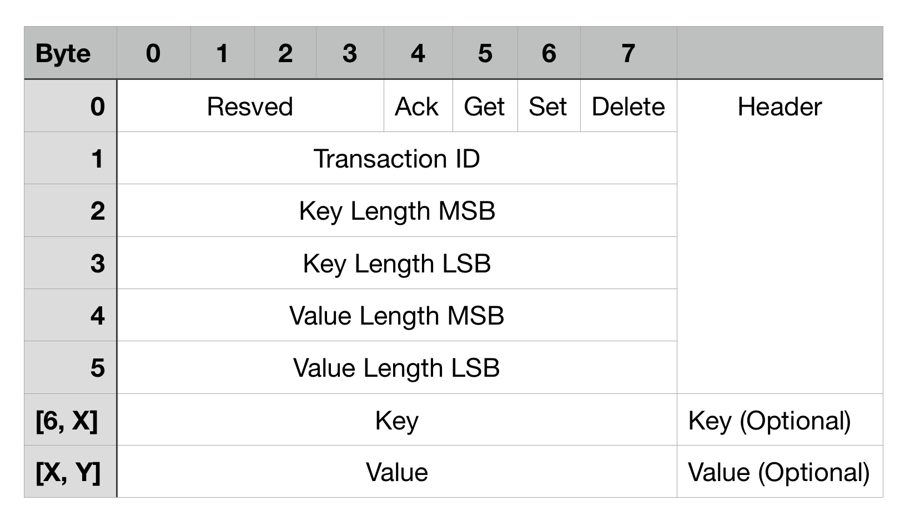
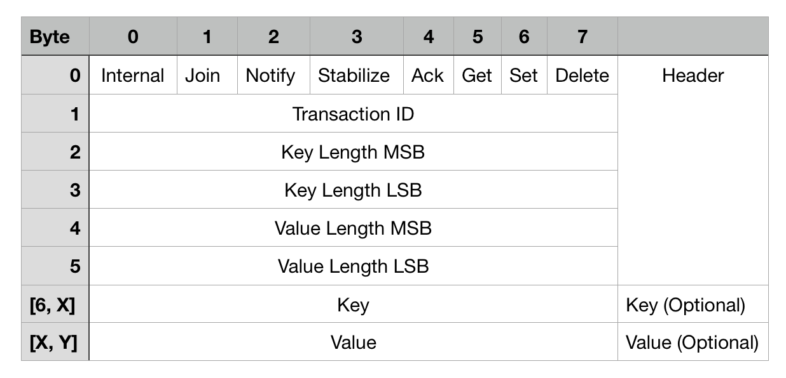

# computer-network-exercises

A collection of small exercises on computer networks, written in C.  
Developed together with [@RKade2811](https://github.com/RKade2811) and [@bert-brause](https://github.com/bert-brause).

## Exercises

The exercises build on top of each other. Issues or bugs in earlier tasks might have been fixed at a later stage.

### 1_udp_tcp

Basic exercises on UDP and TCP communication using the Berkeley Socket API.  
The two QOTD examples also measure the time it takes for requests to finish in order to show the difference between UDP and TCP with regards to speed.

#### udp_qotd
_Arguments:_ `hostname port`

Connects to a Quote-Of-The-Day (RFC 865) Server using UDP and receives a random quote.  
Example servers are:
- alpha.mike-r.com Port 17
- djxmmx.net Port 17
- ziaspace.com Port 17

#### tcp_qotd
_Arguments Server:_ `port filename`  
_Arguments Client:_ `hostname port`

Server implements the Quote-Of-The-Day Protocol (RFC 865) over TCP. Loads the Quotes from a porovided file.
Client is basically a port of _udp_qotd_ to TCP.

#### tcp_image_download
_Arguments:_ `hostname`

Downloads a file (an image) using HTTP over TCP.  
Shows how to load data of size greater than the MTU of TCP packets.

### 2_rpc

This example consists of a Client and Server implementing a small movie database using RPC.  
It also contains the implemtation of a hashtable that is used to store data.

The RPC communication protocol is a custom one:

#### rpc_server
_Arguments:_ `port`

#### rpc_client
_Arguments:_ `hostname port filename`

Takes a CSV file as input and sends all entries to the RPC server to store them. Afterwards it retrieves and deletes the values.

### 3_dht

An implementation of a distributed hashtable using a simplified version of the Chord P2P protocol (for example, we do not use fingertables). `run_dht.sh` launches a ring of 4 nodes that coordinate themselves. The client from _2_rpc_ can be used to communicate to with any of the nodes. Internally, the RPC protocol from the previous exercise was also extended to allow for internal communiction of the ring:

### 4_http

Implemetation of a small HTTP-Webserver using [libonion](https://github.com/davidmoreno/onion). Any message sent is saved in the hashtable from previous exercises and assigned an ID under which it can be retrieved. HTTP Commands `GET`, `POST` and `DELETE` are supported.

> Info: The makefile assumes a precompiled static library saved at `lib/64/libonion_static.a` or `lib/32/libonion_static.a`. Those are not included in this repository.

### 5_ntp

_Arguments:_ `hostname [hostname...]`

A basic implementation of NTP. It takes a list of NTP server adresses and queries the current time from each of them. Afterwards it selects the best of them based on their delay.